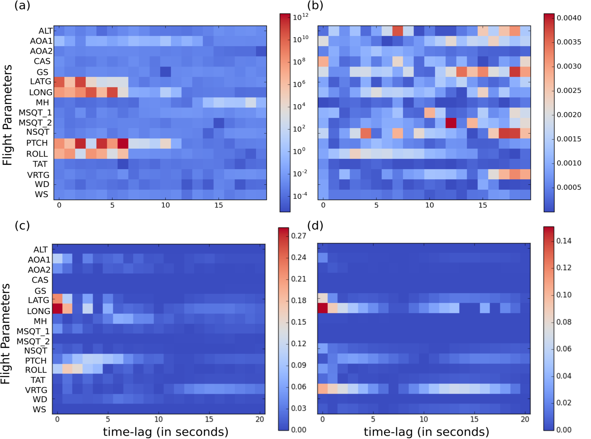
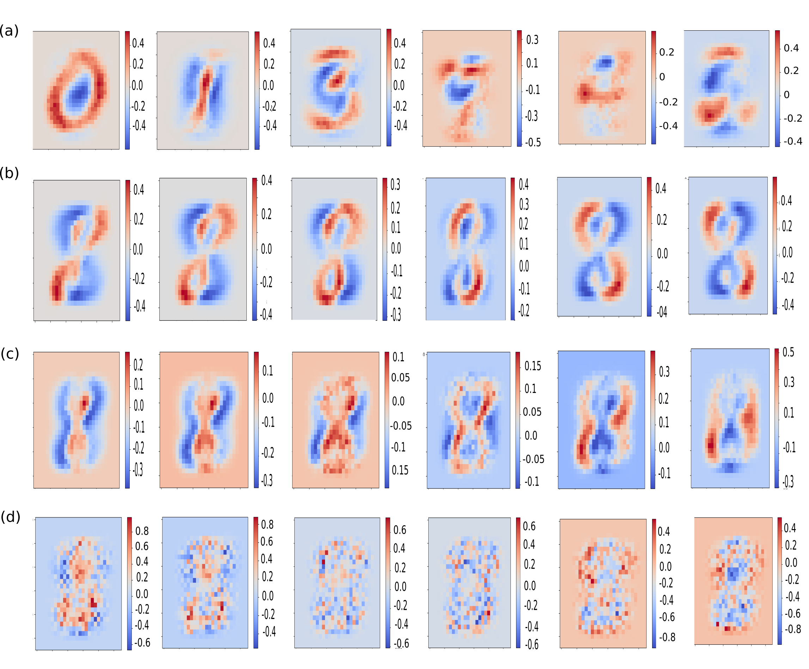

<h1 style="color:Teal">Neural Network Attributions: A Causal Perspective</h1>

<h2 style="font-weight:normal">Aditya Chattopadhyay1&nbsp;
  Piyushi Manupriya2&nbsp;
  Anirban Sarkar2&nbsp;
  <a href="https://www.iith.ac.in/~vineethnb/" style="text-decoration : none; color : #000000;">Vineeth N Balasubramanian</a>2</h2>

<h3>1<a href="http://cis.jhu.edu/" style="color:black; font-weight:normal">Johns Hopkins University</a> &nbsp;&nbsp;&nbsp;&nbsp;2<a href="https://cse.iith.ac.in/" style="color:black; font-weight:normal">IIT Hyderabad</a></h3>

<h3>In ICML 2019</h3>

  

<h3><strong><a href="https://arxiv.org/pdf/1902.02302.pdf">Paper</a> | <a href="https://github.com/Piyushi-0/ACE">Code in Pytorch</a>| <a href="https://github.com/Piyushi-0/ACE/blob/master/ICML_Presentation.pdf">Presentation slides</a></strong> </h3>

<h3>Abstract</h3>

We propose a new attribution method for neural networks developed using first principles of causality (to the best of our knowledge, the first such). The neural network architecture is viewed as a Structural Causal Model, and a methodology to compute the causal effect of each feature on the output is presented. With reasonable assumptions  on  the  causal  structure  of  the  input  data,we propose algorithms to efficiently compute the causal effects, as well as scale the approach to data with large dimensionality. We also show how this method can be used for recurrent neural networks.We report experimental results on both simulated and real datasets showcasing the promise and usefulness of the proposed algorithm.

   
<a href="https://arxiv.org/pdf/1902.02302.pdf">Paper on Arxiv</a>

<h3>Citation</h3>

Aditya Chattopadhyay, Piyushi Manupriya, Anirban Sarkar, Vineeth N Balasubramanian. "Neural Network Attributions: A Causal Perspective", in International Conference on Machine Learning (ICML), 2019.
 
<a href="https://github.com/Piyushi-0/ACE/blob/master/pmlr-v97-chattopadhyay19a.bib">Bibtex</a>

<h3>Some results</h3>

ACE on NASA dataset

ACE on MNIST dataset

<h3>Acknowledgement</h3>

We are grateful to the Ministry of Human Resource Development, India; Department of Science and Technology, India;as well as Honeywell India for the financial support of this project through the UAY program. We thank the anonymous reviewers for their valuable feedback that helped improvethe presentation of this work.

